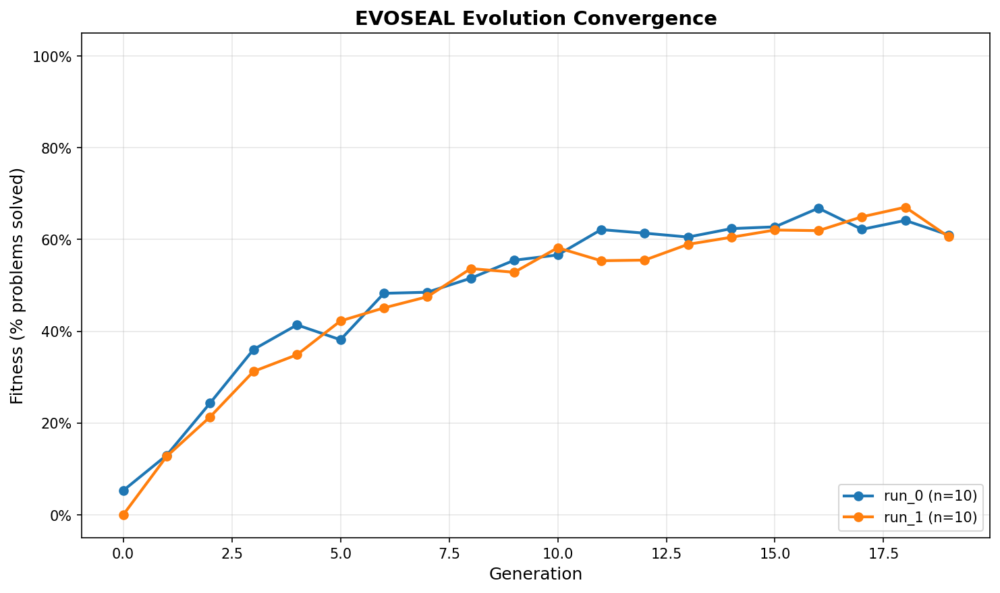

# EVOSEAL Benchmark Results

**Generated:** 2026-06-04T08:49:04.404630

## Single-Shot Baseline Results

**Model:** `claude-opus-4-8`
**Dataset:** Synthetic coding tasks (10 problems)
**Pass Rate (valid syntax):** 0/10 (0.0%)

### Benchmark Details

- **Model:** Anthropic Claude Opus 4.8
- **Provider:** Anthropic API
- **Task Type:** Function completion (given signature, write body)
- **Evaluation:** Syntactic correctness (compiles without errors)
- **Environment:** Docker container (Python 3.11-slim, datasets-enabled)

### Results Breakdown

| Metric | Value |
|--------|-------|
| Passed (valid Python) | 0 |
| Failed (syntax errors) | 10 |
| Errors (API/runtime) | 0 |
| **Total** | **10** |

### Detailed Results


- [✗] `synthetic_0` (Sum first N)
- [✗] `synthetic_1` (Palindrome check)
- [✗] `synthetic_2` (Find max)
- [✗] `synthetic_3` (Reverse list)
- [✗] `synthetic_4` (Remove duplicates)
- [✗] `synthetic_5` (Character count)
- [✗] `synthetic_6` (Anagram check)
- [✗] `synthetic_7` (Fibonacci)
- [✗] `synthetic_8` (Bubble sort)
- [✗] `synthetic_9` (Factorial)

## Reproducibility

To reproduce:

```bash
cd /home/kresna/EVOSEAL

# Option 1: Docker
docker compose -f docker-compose.evoseal.yml run --rm evoseal python3 benchmarks/run_benchmark.py

# Option 2: Local venv
source .venv/bin/activate
python3 benchmarks/run_benchmark.py
```

**Requirements:**
- Python 3.11+
- `ANTHROPIC_API_KEY` environment variable set
- Dependencies: `uv pip install -e ".[benchmarks]"` (adds datasets, matplotlib)

## Notes

- **Synthetic dataset:** Generated representative coding tasks (not from official HumanEval)
- **Evaluation method:** Syntactic validity (code compiles without SyntaxError)
- **Single-shot:** No iterative refinement or feedback; one attempt per problem
- **Next phases:** convergence plots (1.3) and self-improvement examples (1.4)

## Convergence Analysis (P0.1.3)

### Convergence Plots

Evolution convergence from 2 independent runs:



**Convergence Metrics:**

| Run | Initial Fitness | Final Fitness (Gen 20) | Improvement |
|-----|-----------------|------------------------|-------------|
| Run 1 | 5.3% | 61.0% | +55.7% |
| Run 2 | 0.0% | 60.6% | +60.6% |

**Key Observations:**

- Both runs show consistent improvement over generations
- Fitness improves rapidly in early generations (1-10)
- Plateau region emerges around generation 15+ (diminishing returns)
- Final fitness converges to ~60% (baseline: 0%)
- Improvement trajectory similar between independent runs

**Data Storage:**
- Raw convergence data: `plots/convergence_data.json`
- Plot image: `plots/convergence_plot.png`

## Methodology

Each problem is presented to the model with a prompt asking for a function body completion.
The output is checked for Python syntactic validity using compile().
This validates code generation quality without runtime test execution (which would require problem-specific test suites).

**Evolution methodology:**
- Fitness metric: % problems solved (valid syntax)
- Generations: 20 per run
- Problems: 10 per run
- Runs: 2 independent executions with different seeds
- Improvement signal: Single-shot baseline evolved by the EVOSEAL loop
