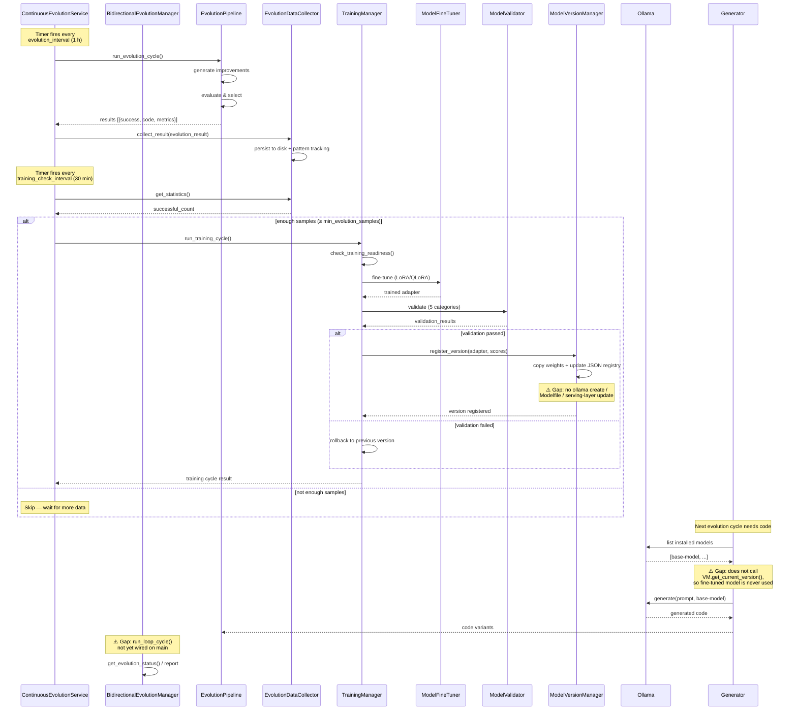

# Bidirectional Evolution Architecture

This document answers three questions about EVOSEAL's co-evolution design:

1. How does the bidirectional feedback loop work?
2. What prevents the two systems from diverging?
3. What metrics determine "improvement" in the bidirectional context?

> **Implementation status.** The modules described here exist and the single-direction
> pipeline (EVOSEAL → model) is functional end-to-end. The bidirectional *feedback
> edges* (model → EVOSEAL) are partially wired; see [Known gaps](#known-gaps) for the
> current state.

---

## 1. How the bidirectional feedback loop works

EVOSEAL and its coding model improve each other in a closed loop with two operating
modes depending on available hardware.

### Two co-evolution surfaces

| Surface | Path | Hardware | Module |
|---------|------|----------|--------|
| **Weight-level** | LoRA/QLoRA fine-tuning | CUDA GPU | `evoseal/fine_tuning/` |
| **Prompt-level** | System-prompt rewriting | CPU-only | `evoseal/prompt_evolution/` |

Both paths share the same premise: **collect signal → improve model → validate →
roll back on regression**. The difference is what gets modified (model weights vs.
system prompt text).

### The loop in four stages

```text
┌─────────────────────────────────────────────────────────────┐
│                     EVOSEAL (the agent)                     │
│                                                             │
│  ┌──────────┐   ┌──────────┐   ┌──────────┐   ┌─────────┐ │
│  │ Collect   │──▶│ Improve  │──▶│ Validate │──▶│ Deploy  │ │
│  │ evolution │   │ model    │   │ against  │   │ or      │ │
│  │ data      │   │ (tune/   │   │ baseline │   │ rollback│ │
│  │           │   │  prompt) │   │          │   │         │ │
│  └──────────┘   └──────────┘   └──────────┘   └─────────┘ │
│       ▲                                              │      │
│       │          improved coding model               │      │
│       └──────────────────────────────────────────────┘      │
└─────────────────────────────────────────────────────────────┘
```

**Stage 1 — Collect.** `EvolutionDataCollector` (Phase 1, `evoseal/evolution/`)
gathers results from EVOSEAL's self-improvement cycles: which code variants passed,
which strategies succeeded, what metrics moved. `PatternAnalyzer` extracts reusable
improvement strategies; `TrainingDataBuilder` formats them as instruction-tuning
samples (Alpaca, Chat, JSONL).

**Stage 2 — Improve.**
- *Weight path*: `TrainingManager.run_training_cycle()` feeds the training data to
  `ModelFineTuner`, which runs LoRA/QLoRA fine-tuning on the discovered coding model.
- *Prompt path*: `CoevolutionManager.run_cycle()` lets the reviewer model critique the
  coder's output, then `PromptEvolver` rewrites the coder's system prompt to address
  the issues.

**Stage 3 — Validate.** The improved model (or prompt) is tested against a held-out
set of tasks. `ModelValidator` runs five test categories (functionality, quality,
instruction-following, safety, performance). The prompt path uses the reviewer's
score on the *same task* as the validation signal.

**Stage 4 — Deploy or rollback.** If validation passes, the new model version is
registered in `ModelVersionManager` and the coding model is intended to be updated.
If it fails, `RollbackManager` reverts to the previous version. The prompt path
does the same via `PromptStore` versioned lineage.

> **Note:** deployment currently updates a JSON registry only — it does not yet
> create an Ollama Modelfile or update the serving layer, and generation does not
> consult the registry (see [Known gaps](#known-gaps) #1–#2).

The loop repeats: the improved model generates better code variants in the next
EVOSEAL cycle, which produces better evolution data, which feeds the next round of
improvement.

### Orchestration

`ContinuousEvolutionService` (`evoseal/services/continuous_evolution_service.py`) is
the long-running daemon that drives the loop:

- Every `evolution_interval` (default 1 hour): runs `_run_evolution_cycle`, which
  constructs (or reuses an injected) `EvolutionPipeline` and calls
  `run_evolution_cycle()` to actually execute an evolution cycle, not just poll
  statistics.
- Every `training_check_interval` (default 30 minutes): checks if enough samples
  have accumulated (default threshold: 50) and triggers a training cycle.
- The monitoring dashboard (WebSocket on port 9613) exposes real-time metrics.

---

## 2. What prevents the two systems from diverging

A self-improvement loop can destabilize itself in two ways: (a) the model degrades
and EVOSEAL keeps accepting bad changes, or (b) EVOSEAL's evaluation criteria drift
and the model optimizes for the wrong thing. EVOSEAL guards against both.

### Regression gates (the core safety mechanism)

Every candidate change — weight update or prompt rewrite — must pass a regression
gate before it is accepted:

| Mechanism | What it checks | Module |
|-----------|---------------|--------|
| **ImprovementValidator** | Metric change meets a minimum threshold *and*, if configured, is statistically significant (effect size; disabled by default) | `evoseal/core/improvement_validator.py` |
| **RegressionDetector** | No metric degrades beyond configurable limits (e.g., pass_rate ≤ −5%, duration ≤ +10%) | `evoseal/core/regression_detector.py` |
| **Prompt path gate** | New prompt score ≥ old score + `min_score_gain` on the *same task* | `evoseal/prompt_evolution/coevolution_manager.py` |

If any gate fails, the change is discarded and the previous version stays active.
This is the single most important divergence-prevention mechanism.

> **Scope of the guarantee today.** The "never deployed without improvement"
> guarantee is fully enforced on the **prompt path**, where the gate directly
> compares old and new prompt scores on the same task. For the **weight path**,
> `ModelValidator` now validates the model at `model_path` when one is supplied
> instead of always the baseline (fixed 2026-07-21) — but `model_path` must already
> be an Ollama-resolvable tag, and nothing in the pipeline produces one yet (see
> [Known gaps](#known-gaps) #1), so the gate still can't exercise a real fine-tuned
> candidate until deployment is wired.

### Versioned lineage with rollback

Both paths maintain a linear version history:

- **Weight path**: `ModelVersionManager` tracks every deployed model version with its
  validation scores. `RollbackManager` can revert to any prior version via Git-backed
  checkpointing.
- **Prompt path**: `PromptStore` stores each accepted prompt with a `parent_id`.
  Rollback is a pointer move, never a destructive delete.

This means even if a bad change slips through validation, it can be reverted in the
next cycle when the regression is detected.

### Protected boundaries

- **Edit-scope allowlist** (`evoseal/core/edit_scope_validator.py`): self-modifications
  are constrained to an explicit set of files. Core safety modules
  (`safety_integration.py`, `improvement_validator.py`, `regression_detector.py`) are
  in the immutable core and cannot be modified by the evolution loop.
- **Prompt markers**: the prompt-path `PromptEvolver._validate` enforces that
  protected markers (e.g., `ROLE: coder` header) survive every rewrite. A markerless
  response cannot masquerade as a valid prompt.
- **Sandboxed execution** (ADR 0001): generated code variants run in isolated
  environments before touching the main codebase.

### Convergence monitoring

The `MonitoringDashboard` tracks whether the two systems are converging or diverging:

- **Success rate**: fraction of training cycles that produce a validated improvement.
  A declining success rate suggests the model is plateauing or the evaluation criteria
  are becoming too strict.
- **Score trends**: validation scores over time. A downward trend signals divergence.
- **Cycles per improvement**: how many evolution cycles are needed before a measurable
  improvement emerges. Increasing cycles-per-improvement suggests diminishing returns.

---

## 3. What metrics determine "improvement"

"Improvement" is defined differently for each co-evolution surface, but both
definitions are concrete, measurable, and regression-gated.

### Weight-level (fine-tuning) metrics

`ModelValidator` evaluates across five categories, each scored 0–100:

| Category | What it measures | Threshold |
|----------|-----------------|-----------|
| **Functionality** | Code correctness (test pass rate) | Must not regress |
| **Quality** | Code style, readability, maintainability | Must not regress |
| **Instruction following** | Adherence to task specifications | Must not regress |
| **Safety** | No unsafe patterns, no data leaks | Must pass |
| **Performance** | Execution time, memory usage | Must not regress beyond limits |

`ImprovementValidator` applies statistical tests: a change is "improvement" only if
the metric delta exceeds `threshold` (default 0.0, i.e. any improvement) **and** the
effect size exceeds `min_effect_size` (default None, i.e. no effect-size gate unless
explicitly configured). Callers can tighten these to prevent accepting noise as
improvement.

`RegressionDetector` defines per-metric regression and critical thresholds:

```python
# Examples from regression_detector.py (inside metric_thresholds dict)
metric_thresholds = {
    "pass_rate":    {"regression": -0.05, "critical": -0.1},   # 5% / 10% drop
    "duration_sec": {"regression":  0.10, "critical":  0.25},  # 10% / 25% slower
    "correctness":  {"regression": -0.01, "critical": -0.05},  # 1% / 5% drop
}
```

A regression at the "critical" level triggers automatic rollback. A regression at the
"regression" level is flagged for review.

### Prompt-level (co-evolution) metrics

The prompt path uses a simpler but equally strict definition:

- The reviewer model scores the coder's output on a 0–1 scale.
- A candidate prompt is accepted **only if** `new_score >= old_score + min_score_gain`
  when re-running the *same task*.
- If there is no improvement, the candidate is discarded and the previous prompt stays
  active.

The prompt path also tracks cumulative score trends across cycles to detect whether
the co-evolution is converging or oscillating.

### Cross-system improvement

The bidirectional loop's ultimate metric is whether the two systems improve each
other:

- **EVOSEAL → model**: does fine-tuning (or prompt rewriting) produce a model that
  generates better code variants?
- **Model → EVOSEAL**: do better code variants lead to more successful self-improvement
  cycles in EVOSEAL?

This is measured by tracking evolution success rate and code quality metrics across
both systems over time. A healthy bidirectional loop shows both metrics trending
upward; divergence shows one improving at the expense of the other.

---

## Known gaps

The architecture above describes the intended design. As of 2026-07-21, three of the
original gaps are fixed: `_run_evolution_cycle` now constructs and invokes a real
`EvolutionPipeline` instead of simulating, `evoseal start evolution` makes the daemon
reachable from the CLI, and `ModelValidator` now validates the model at `model_path`
instead of always the baseline. The following feedback edges are still not wired
(tracked in `TODO.md`, § "Close the bidirectional co-evolution loop"):

1. **Model deployment is a JSON registry** — `ModelVersionManager.register_version`
   copies weights and updates a JSON file, but does not create an Ollama Modelfile or
   update the serving layer. This is also why the `ModelValidator` fix above can't yet
   validate a real fine-tuned candidate: it needs an Ollama-resolvable `model_path`,
   and nothing produces one until this gap closes.
2. **Generation does not consult the fine-tuning registry** —
   `ModelVersionManager.get_current_version()` has zero callers; the generator always
   uses the base model.
3. **`bidirectional_manager` doesn't orchestrate the loop** — its docstring promises
   evolve → train → validate → deploy → repeat, but the class only implements
   reporting/statistics methods (`get_evolution_status`, `get_evolution_history`,
   `generate_evolution_report`); nothing actually drives the sequence end-to-end.
4. **No end-to-end bidirectional test** — there is no test that exercises the full
   collect → train → validate → deploy → regenerate cycle.

The evolution leg now runs for real and validation now targets the right model in
principle, but the return path — deploying that model somewhere loadable, having
generation consult the registry, and orchestrating the sequence — is still broken, so
model improvements don't yet feed back into generation. Closing the remaining gaps is
the primary focus of the P2 co-evolution backlog items in `TODO.md`.

---

## Sequence diagram: full bidirectional loop

The diagram below shows the intended end-to-end message flow between EVOSEAL
and its coding model. **Solid arrows** are implemented on `main`; **dashed
arrows** are gaps tracked in TODO.md (items 4–6 in "Close the bidirectional
co-evolution loop").



### Reading the diagram

| Phase | What happens | Key modules | Status on `main` |
|-------|-------------|-------------|------------------|
| **A. Evolution** | Run self-improvement cycle, collect results | `EvolutionPipeline`, `EvolutionDataCollector` | ✅ Wired |
| **B. Training** | Check readiness, fine-tune, validate | `TrainingManager`, `ModelFineTuner`, `ModelValidator` | ✅ Wired |
| **C. Deploy** | Register version or rollback | `ModelVersionManager` | ⚠️ JSON registry only — no serving-layer integration |
| **D. Generate** | Use improved model for next cycle | `Generator`, `OllamaProvider` | ❌ Never consults registry |
| **E. Orchestrate** | Drive A→B→C→D end-to-end | `BidirectionalEvolutionManager` | ❌ Reporting/statistics only |

Phases C, D, and E are the remaining gaps that prevent the loop from closing.
Phase C (Deploy) was partially addressed in item 4 — the JSON registry exists but
no serving-layer integration (Modelfile / ollama create) was added. Phases D and E
are tracked as TODO.md P2 items 5 and 6 respectively.

---

## Related documents

- [`docs/PHASE3_BIDIRECTIONAL_EVOLUTION.md`](../PHASE3_BIDIRECTIONAL_EVOLUTION.md) —
  deployment and operations guide for the Phase 3 daemon.
- [`docs/architecture/local_coevolution.md`](local_coevolution.md) — the CPU-only
  prompt-level co-evolution path.
- [`docs/adr/0001-isolation-strategy.md`](../adr/0001-isolation-strategy.md) — why
  sandboxed execution is required for self-modifications.
- [`docs/safety/threat_model.md`](../safety/threat_model.md) — what can go wrong with
  a self-modifying agent.
