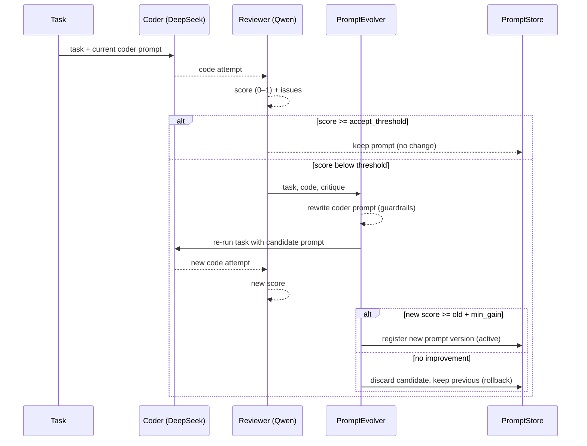

# Local (CPU) Prompt-Level Co-Evolution

EVOSEAL's original Phase 3 co-evolution improves a coding model by **fine-tuning its
weights** (LoRA/QLoRA) from evolution data — a path that needs a CUDA GPU. On a
CPU-only host that path is impractical, and a cloud model (e.g. the `main` agent)
has no local weights to tune at all.

This document describes the **CPU-feasible** substitute implemented in
`evoseal/prompt_evolution/`: the agents co-evolve at the **prompt level** instead of
the **weight level**. Two local Ollama models take distinct roles, and the reviewer's
feedback is distilled into edits of the coder's *system prompt*. No GPU required.

## Roles and models

Models are **discovered from what is installed in Ollama** and matched by family
(`evoseal/providers/local_models.py`), so a re-quantized or renamed tag keeps working.

| Role       | Default family        | Job                                   |
|------------|-----------------------|---------------------------------------|
| `coder`    | DeepSeek-Coder-V2-Lite | Writes code for a task                |
| `reviewer` | Qwen2.5-Coder          | Critiques the code, scores it (0–1)   |
| `main`     | cloud model (MiMo)     | Orchestrator; prompt-only improvement |

Override a role explicitly with `EVOSEAL_CODER_MODEL` / `EVOSEAL_REVIEWER_MODEL`.

## The loop (one cycle)



Implemented by `CoevolutionManager.run_cycle` (`coevolution_manager.py`):

1. **generate** — coder writes code using its active system prompt.
2. **review** — reviewer returns issues and a `SCORE: X/10` (normalized to 0–1).
3. **evolve** — if the score is below `accept_threshold`, the reviewer model rewrites
   the coder's system prompt to address the issues.
4. **validate** — the task is re-run with the candidate prompt; the new prompt is
   **accepted only if the score improves by at least `min_score_gain`**, otherwise it
   is discarded and the previous prompt stays active.

## Divergence prevention / "definition of improvement"

This mirrors EVOSEAL's "validate or roll back" safety premise so the self-editing loop
cannot silently corrupt itself:

- **Guardrails on every edit** (`PromptEvolver._validate`): the candidate must be
  non-empty, within length bounds, differ from the current prompt, and **retain all
  protected markers** (e.g. the `ROLE: coder` header). A markerless model response is
  only accepted via fallback extraction when it still carries those markers, so a plain
  critique cannot masquerade as a prompt.
- **Regression gate**: "improvement" is defined concretely as a measured reviewer-score
  gain of at least `min_score_gain` on the *same task* re-run with the candidate prompt.
  No gain → rollback.
- **Versioned lineage** (`PromptStore`): every accepted prompt is a new version with a
  `parent_id`; rollback is a pointer move, never a destructive delete.

## Usage

```python
import asyncio
from evoseal.prompt_evolution import CoevolutionManager, TaskSpec


async def main():
    mgr = CoevolutionManager()  # discovers coder+reviewer models from Ollama
    task = TaskSpec(id="demo", description="Write median(nums) for a list of numbers")
    result = await mgr.run_cycle(task)
    print(result.reason, result.score_before, "->", result.score_after)


asyncio.run(main())
```

Prompt versions persist under `data/prompt_evolution/<role>/` (registry + one `.md`
per version), so improvements survive restarts and can be inspected or rolled back.

## Relationship to the GPU path

The weight-fine-tuning path (`evoseal/fine_tuning/`, `ModelFineTuner`,
`BidirectionalEvolutionManager`) targets a discovered coding model and remains the
option for GPU hosts (a deprecated `DevstralFineTuner` alias is kept for compatibility).
The two paths share the same premise — collect signal from evolution, improve the
model, validate, and roll back on regression — but operate on different surfaces
(prompt text vs. model weights).
