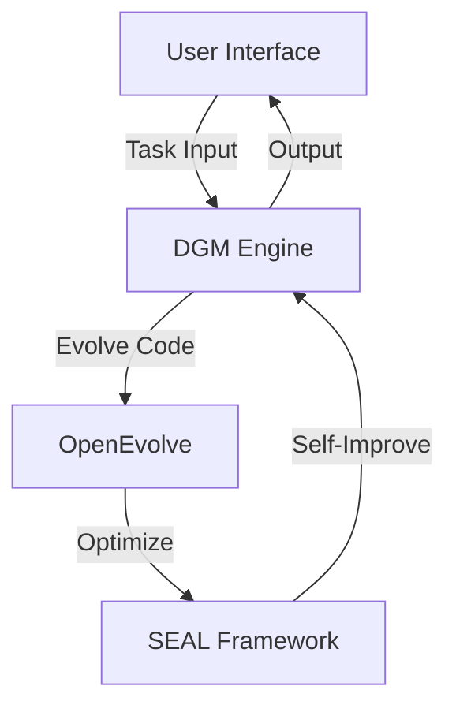

# Architecture Overview

EVOSEAL is built on a modular architecture that integrates three core components to create a self-improving AI system.

## High-Level Architecture

## Core Components

### 1. DGM (Dynamic Genetic Model)
- **Purpose**: Implements evolutionary algorithms for code improvement
- **Key Features**:
  - Population management
  - Fitness evaluation
  - Selection and crossover mechanisms
  - Mutation strategies

### 2. OpenEvolve
- **Purpose**: Program optimization framework
- **Key Features**:
  - MAP-Elites algorithm
  - Checkpointing system
  - Performance metrics tracking
  - Parallel execution

### 3. SEAL (Self-Adapting Language Models)
- **Purpose**: Enables models to generate self-edits
- **Key Features**:
  - Few-shot learning
  - Knowledge incorporation
  - Self-modification capabilities

## Data Flow

1. **Initialization**:
   - User provides a task and initial parameters
   - System loads appropriate models and configurations

2. **Evolution Cycle**:
   - DGM generates candidate solutions
   - OpenEvolve optimizes and evaluates solutions
   - SEAL applies self-improvement techniques
   - Best solutions are selected for next generation

3. **Output**:
   - Final solution is returned to the user
   - Performance metrics and evolution history are logged

## Integration Points

- **Configuration**: Centralized configuration management
- **Logging**: Unified logging across all components
- **APIs**: Well-defined interfaces between components
- **Data Storage**: Efficient storage for checkpoints and metrics

## Scalability Considerations

- Distributed execution support
- Resource management
- Parallel processing capabilities
- Memory optimization

## Security

- Input validation
- Code sandboxing
- Access control
- Audit logging

## Performance

- Caching mechanisms
- Lazy loading of resources
- Efficient data structures
- Asynchronous operations