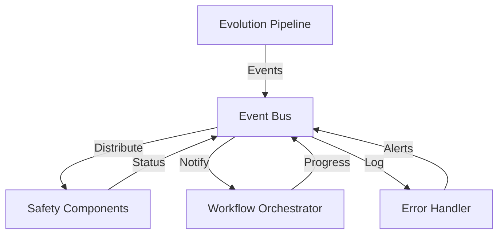

# Core System Documentation

This section covers the core systems and infrastructure components that power EVOSEAL's evolution pipeline.

## Overview

The core system provides the foundational infrastructure for EVOSEAL's self-improving AI capabilities:
- **Event System**: Component communication and observability
- **Error Handling & Resilience**: Robust error recovery and system resilience
- **Workflow Orchestration**: End-to-end workflow management
- **Version Control & Experiment Tracking**: Comprehensive tracking and versioning
- **Agentic Systems**: AI agent implementations
- **Knowledge Management**: Knowledge base and prompt systems

## Core Components

### Communication & Events
- [Event System](event_system.md) - Enhanced event system for component communication
- [Workflow Orchestration](workflow_orchestration.md) - End-to-end workflow coordination

### Reliability & Resilience
- [Error Handling](error_handling.md) - Basic error handling mechanisms
- [Error Handling & Resilience](error_handling_resilience.md) - Advanced resilience and recovery

### Tracking & Management
- [Version Control & Experiment Tracking](version_control_experiment_tracking.md) - Comprehensive versioning and experiment management

### AI & Knowledge Systems
- [Agentic System](agentic_system.md) - AI agent implementations and workflows
- [Prompt Template System](prompt_template_system.md) - Template management for AI interactions
- [Knowledge Base](knowledge_base.md) - Knowledge management and storage

## Key Features

### 🔄 Event-Driven Architecture
- **Comprehensive Event Types**: 40+ event types covering all pipeline aspects
- **Structured Event Data**: Specialized classes with automatic data synchronization
- **Advanced Filtering**: Multi-criteria event filtering with custom functions
- **Performance Monitoring**: Built-in metrics collection and threshold alerting

### 🛡️ Resilience & Recovery
- **Circuit Breaker Pattern**: Failure isolation with configurable thresholds
- **Health Monitoring**: Real-time component health tracking
- **Recovery Strategies**: Multiple recovery actions with automatic fallback
- **Background Monitoring**: Continuous system health assessment

### 🎯 Workflow Orchestration
- **Complete Lifecycle Management**: From initialization to completion
- **State Persistence**: Automatic state recovery across system restarts
- **Resource Monitoring**: Real-time resource usage tracking
- **Checkpoint System**: Comprehensive checkpointing with recovery

### 📊 Experiment Tracking
- **Complete Experiment Lifecycle**: From creation to analysis
- **Version Integration**: Full Git integration with automatic tagging
- **Metrics Collection**: Real-time metrics and performance tracking
- **Multi-experiment Comparison**: Advanced comparison and analysis tools

## Architecture Integration

### Component Communication


### Data Flow
1. **Event Generation**: Components publish events for state changes
2. **Event Processing**: Event bus distributes to subscribers
3. **Workflow Coordination**: Orchestrator manages execution flow
4. **Error Handling**: Resilience manager handles failures
5. **State Persistence**: Version control tracks all changes

## Getting Started

### Basic Setup
1. **Event System**: Configure event publishing and subscription
2. **Error Handling**: Set up resilience mechanisms
3. **Workflow**: Define workflow steps and dependencies
4. **Tracking**: Initialize version control and experiment tracking

### Integration Example
```python
from evoseal.core.events import EventBus, create_component_event
from evoseal.core.resilience import ResilienceManager
from evoseal.core.orchestration import WorkflowOrchestrator

# Initialize core systems
event_bus = EventBus()
resilience = ResilienceManager(event_bus=event_bus)
orchestrator = WorkflowOrchestrator(
    event_bus=event_bus,
    resilience_manager=resilience
)

# Publish events
event = create_component_event(
    component_type="evolution_pipeline",
    component_id="main",
    operation="started"
)
event_bus.publish(event)
```

## Configuration

### Event System Configuration
```yaml
events:
  max_history: 1000
  enable_metrics: true
  log_level: INFO
```

### Resilience Configuration
```yaml
resilience:
  circuit_breaker:
    failure_threshold: 5
    timeout: 30
  health_monitoring:
    interval: 10
    enabled: true
```

### Orchestration Configuration
```yaml
orchestration:
  execution_strategy: "adaptive"
  checkpoint_interval: 100
  resource_monitoring: true
```

## Performance Considerations

### Event System
- **Efficient Publishing**: Asynchronous event processing
- **Memory Management**: Configurable event history limits
- **Filtering Performance**: Optimized event filtering algorithms

### Resilience
- **Circuit Breaker**: Prevents cascade failures
- **Health Checks**: Minimal overhead monitoring
- **Recovery Speed**: Fast automatic recovery mechanisms

### Orchestration
- **Parallel Execution**: Concurrent workflow step execution
- **Resource Optimization**: Adaptive resource allocation
- **State Efficiency**: Optimized state serialization

## Monitoring & Observability

### Metrics Collection
- Event processing rates and latencies
- Component health and availability
- Workflow execution progress and timing
- Error rates and recovery success

### Logging Integration
- Structured logging with correlation IDs
- Event-driven log aggregation
- Performance metrics logging
- Error and exception tracking

## Best Practices

### Event System
- Use appropriate event types for different scenarios
- Implement proper error handling in event handlers
- Monitor event processing performance
- Use event filtering to reduce noise

### Resilience
- Configure appropriate circuit breaker thresholds
- Implement graceful degradation strategies
- Monitor health check performance
- Test recovery procedures regularly

### Orchestration
- Design workflows with proper dependencies
- Use checkpointing for long-running processes
- Monitor resource usage patterns
- Implement proper cleanup procedures

## Troubleshooting

### Common Issues
- **Event Processing Delays**: Check event handler performance
- **Circuit Breaker Activation**: Review failure patterns and thresholds
- **Workflow Hangs**: Verify step dependencies and resource availability
- **Memory Issues**: Monitor event history and state persistence

### Debugging Tools
- Event system metrics and history
- Resilience manager status reports
- Workflow orchestrator state inspection
- Version control and experiment tracking logs

The core system provides a robust foundation for building scalable, reliable, and observable AI evolution pipelines.
